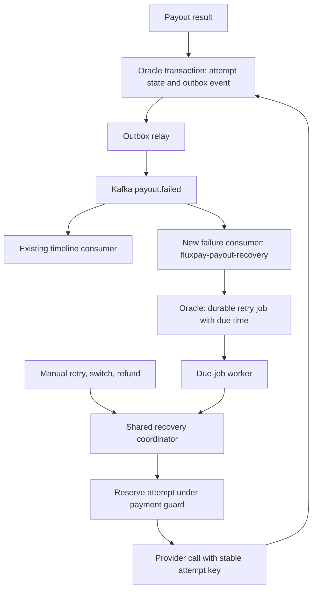

# Kafka-driven payout retries

Status: Proposed; implementation has not started.  
Date: 2026-09-10

## Objective and scope

Automatically retry a definitively failed payout on the same provider route when its failure is transient. Kafka delivers failure notifications; Oracle holds the retry schedule and execution state. The existing payment timeline continues consuming events independently.

The first release supports bounded retries, restart recovery, duplicate suppression, and coordination with manual retry, route switch, and refund. It does not automatically change routes, refund payments, or retry an ambiguous provider outcome. Automatic recovery must never debit the sender again.

All new classes, topics, tables, settings, and behavior below are proposals unless explicitly described as existing.

## Existing implementation

| Component | Current behavior | Design implication |
| --- | --- | --- |
| `config/PaymentEventConsumer.java` | Consumes seven topics in group `fluxpay-timeline`; delegates to timeline ingestion | Keep this consumer; introduce a separate group for recovery |
| `service/PaymentEventIngestionService.java` | Stores events idempotently by event ID | Timeline deduplication does not prevent duplicate provider calls |
| `controller/PayoutController.java` | `POST /api/payments/{paymentId}/retry-payout` calls recovery synchronously | Manual recovery must share concurrency protection with automatic recovery |
| `service/RecoveryService.java` | Requires the latest attempt to be `FAILED`; creates the next attempt on the same route | Reuse its business rules after extracting a guarded recovery coordinator |
| `service/PayoutExecutionService.java` | Saves attempts, calls providers, and publishes events within a Spring transaction | Split database transactions from provider I/O; add a transactional outbox |
| `config/KafkaEventPublisher.java` | Sends to Kafka directly and waits for the send result | Oracle state and Kafka publication are currently separate commits |
| `config/InMemoryPaymentReader.java`, `config/InMemoryPaymentEligibilityGate.java` | Mock-profile state, including one `P-001` payment | Neither is sufficient for durable production recovery |
| `dto/PayoutCmd.java`, `service/PayoutProvider.java` | Submit interface lacks an explicit idempotency key and status lookup | Extend the provider contract before enabling real automatic payouts |

Java paths above are relative to `backend/src/main/java/com/fluxpay/`.

## Architecture



The failure consumer schedules work and returns after its database transaction commits. A worker polls due jobs; it does not sleep inside a Kafka listener. This keeps delays durable and permits cancellation when the user takes another recovery action.

Use one new consumer group, `fluxpay-payout-recovery`, subscribing to `payout.failed`. Using the timeline group would distribute records between timeline and recovery rather than deliver each record to both functions.

Use Oracle scheduling for v1 rather than a sequence of delay topics: the application already depends on Oracle, and retry cancellation and payment locking require database state. No `payout.retry.requested` topic is needed for this version. A dedicated worker deployment can be introduced later without changing the persistence contract.

## Retry policy

These are initial configurable defaults, not business requirements already present in the repository.

| Rule | Proposed default |
| --- | --- |
| Enabled | `false`; explicitly enable for a controlled rollout |
| Maximum payout attempts | 4 total, including initial submission; manual retry and route switch also consume this budget |
| Delay after failed attempts 1, 2, and 3 | 30 seconds, 2 minutes, and 10 minutes |
| Jitter | Add a persisted random delay from 0% to 20% of the base delay |
| Automatic recovery window | 24 hours from the initial payout attempt |
| Worker poll interval | 1 second; due time is a lower bound, not an execution SLA |
| Unknown error code | Hold for review; do not automatically retry |

Classify failures using an explicit provider-specific allowlist and a confirmed outcome. Provider rejection due to temporary unavailability or rate limiting may be retryable only when the provider confirms that it did not accept the payout. Invalid beneficiary details, rejected compliance checks, unsupported currency, and permanent rejection are not retryable.

A timeout or lost connection can mean that the provider accepted the payout but the response was lost. Such an outcome enters `RECONCILIATION_REQUIRED`, not a new payout attempt. The current mock adapter returns `PROVIDER_TIMEOUT` without making an external payment; tests must distinguish this simulated known failure from a real timeout. The error string alone must never authorize a resend.

At execution time, recheck the latest attempt, payment status, active route, current compliance/eligibility, attempt budget, and recovery window. Do not reuse `assertActiveQuote` blindly: its mock quote expires after 15 minutes, whereas retries concern an already accepted payment. Production retry eligibility needs its own contract.

## Failure event contract

Keep the existing `PaymentEventEnvelope` fields: `eventType`, `eventId`, `paymentId`, `correlationId`, `occurredAt`, and `payload`. Preserve the existing failure payload fields `routeCode`, `attempt`, `summary`, `error`, and `errorMessage`. Add:

```json
{
  "schemaVersion": 2,
  "attemptId": "<persisted payout attempt ID>",
  "outcomeCertainty": "CONFIRMED_FAILED",
  "failureCategory": "TRANSIENT"
}
```

This example contains the additional payload fields only. Validate the full envelope, Kafka key equals `paymentId`, topic equals `eventType`, positive attempt number, and recognized schema version. Read amounts, beneficiary information, route, and status from authoritative storage rather than trusting event data to authorize a payment.

Key events by `paymentId`. Do not assume ordering across topics. Under the payment guard, verify that `attemptId` and `attempt` identify the current failed attempt. Older events become audited no-ops. Events that reference inconsistent or missing persisted state enter review rather than triggering a payout.

For legacy events without the new fields, record `LEGACY_EVENT_REVIEW_REQUIRED` and acknowledge after that decision is durable. They must not silently initiate automatic retries.

## Durable state

Add new Flyway migrations using the next available version at implementation time; do not edit existing migrations. Confirm identifier mappings first: the schema uses Oracle `RAW(16)` while some Java entities use strings and the mock payment uses `P-001`. New foreign keys must use the canonical payment/attempt identifier representation.

| Table | Key fields and constraints |
| --- | --- |
| `payment_recovery_state` | One row per payment; recovery disposition, active attempt ID, version, timestamps; row is the shared lock for submit/retry/switch/refund |
| `payout_retry_jobs` | Job ID, payment ID, failed attempt ID, source event ID, target attempt number, status, due time, expiry, policy version, lease owner/token/expiry, reserved attempt ID, decision reason; unique failed attempt ID and unique source event ID |
| `recovery_event_inbox` | Unique event ID, original topic/partition/offset, payload hash, processing decision, processed time; preserves decisions even when no job is created |
| `payment_event_outbox` | Stable event ID, topic, payment key, serialized envelope, creation time, publication time, delivery attempts, next delivery time and relay lease |

Retain the existing unique `(payment_id, attempt_number)` constraint as a final safeguard. Add indexes for due pending jobs, expired leases, and unpublished outbox rows. Duplicate event IDs with different payload hashes are invalid and must be quarantined.

Retry job states: `PENDING`, `IN_FLIGHT`, `SUCCEEDED`, `FAILED`, `CANCELLED`, `EXHAUSTED`, and `RECONCILIATION_REQUIRED`. A failed execution completes its job as `FAILED`; its new failure event may create the next job. Jobs are not repeatedly reset to `PENDING` to represent new business attempts.

`payment_recovery_state` also persists completion, refund, and reconciliation holds. Refund safety must not depend on whether the asynchronous timeline has ingested `payment.refunded` yet. Keep inbox/job deduplication history for at least the supported event replay period; retention and archival are deployment policy decisions.

## Processing and transaction boundaries

1. **Persist the original result.** In one Oracle transaction, save the confirmed payout result and an outbox event. The initial payout path and all recovery paths use this rule; fixing only retry publication would still allow the first failure event to be lost.
2. **Relay events.** A relay claims unpublished outbox rows, sends with the saved event ID, and marks them published only after broker acknowledgement. A crash after send can produce a duplicate; receivers must tolerate it. Retry publication independently of payment attempt limits.
3. **Schedule recovery.** The failure consumer starts an Oracle transaction, deduplicates its inbox record, locks the payment guard, checks the failed attempt and policy, and inserts a job or records a skip/hold/exhaustion decision. Return successfully only after commit; then allow the listener container to commit the Kafka offset. Use a separate transactional service so commit completes before listener success.
4. **Reserve execution.** A worker claims a due job using a short database transaction and a lease. In a guarded transaction, recheck eligibility, allocate the next attempt, save the stable provider key, set the job to `IN_FLIGHT`, and commit before calling the provider. All contenders lock the payment guard before changing job/attempt state to keep lock ordering consistent.
5. **Call the provider.** Perform network I/O outside the Oracle transaction with a bounded timeout. Use an idempotency key derived from the persisted attempt ID, for example `payout:<attemptId>`. Transport retries reuse that key and attempt; a new confirmed business attempt gets a new key.
6. **Persist the outcome.** In another guarded transaction, validate the worker lease token and reserved attempt, save the result and job state, and append corresponding outbox events. An ambiguous result creates a reconciliation hold. Repeated terminal writes are idempotent and cannot overwrite a conflicting result.

`saveAndFlush` in the existing execution service is not a transaction commit. Refactor transaction ownership explicitly; avoid self-invocation of Spring transactional methods. Reuse provider selection and attempt/event construction where possible, but do not call the current `RecoveryService.retry(...)` unchanged from the listener.

Delivery is at least once. Kafka transactions alone do not make Oracle writes and an external provider call atomic; external systems need coordinated state and idempotency. See [Apache Kafka delivery semantics](https://kafka.apache.org/38/design/design/).

## Crash recovery and concurrent actions

| Situation | Required behavior |
| --- | --- |
| Crash after inbox/job commit but before offset commit | Redelivery finds the durable decision; no second job |
| Crash after attempt reservation, before or during provider call | Expired lease triggers reconciliation of the same attempt; never immediately allocate a new one |
| Provider succeeded but process crashed before saving result | Query provider by stable key/reference; persist the existing success |
| Provider supports idempotent submit but status lookup is inconclusive | Re-submit only the same attempt/key within the provider's documented idempotency retention period |
| Provider offers neither safe lookup nor idempotent submit | Hold for operator reconciliation; block automated use of that provider |
| Two workers claim the same job or an old worker returns late | Lease token and payment guard reject stale state updates; provider key protects external effects |
| Manual retry or route switch wins the payment guard first | Cancel pending automatic job and reserve the manual attempt atomically |
| Automatic worker has already reserved an attempt | Manual retry/switch/refund returns an explicit conflict; do not start another action |
| Refund wins while no attempt is active | Atomically mark refund disposition and cancel pending jobs alongside the ledger operation, or use a durable refund intent if the ledger is external |
| Old failure arrives after completion/refund/new attempt | Record a stale-event decision; do not retry |

The existing controller's in-memory idempotency gate must be replaced for production. HTTP idempotency results must be durable and recorded with action reservation; a failed validation must not be stored as a completed confirmation. Preserve existing successful response shapes where possible; define conflict responses for actions already in progress.

## Infrastructure failures and dead letters

Separate message-processing retries from payout retries. An Oracle outage, Kafka send failure, or malformed JSON must not consume a business payout attempt.

Configure the recovery listener independently with String deserialization, auto offset commits disabled, and record acknowledgements after transactional ingestion succeeds. Start with concurrency 1 and increase only up to the topic partition count. Provider calls run in the job worker, so slow providers do not hold Kafka listener threads.

For temporary database failures, use bounded short processing retries, then pause the affected recovery container/partition with an alert and controlled recovery probes. Do not acknowledge or skip that record while persistence remains unavailable. For poison records, publish a quarantine envelope to `payout.recovery.dlt`, including original topic/partition/offset, original event ID if readable, error category, and a deterministic quarantine ID. Advance the source offset only after DLT publication is acknowledged; duplicate DLT records are acceptable and deduplicated operationally.

The DLT is an operational envelope, not a `PaymentEventEnvelope`, and is not added to the existing timeline whitelist. Exhausted business retries are a durable recovery decision, not poison messages. Replay requires an audited operator action and passes through the same inbox and current-state checks. Do not automatically replay the DLT.

## Configuration and local operation

Proposed application settings, to be implemented and validated at startup:

```yaml
fluxpay:
  payout-retry:
    enabled: ${PAYOUT_RETRY_ENABLED:false}
    consumer-group: fluxpay-payout-recovery
    max-total-attempts: 4
    delays: [30s, 2m, 10m]
    jitter-percent: 20
    max-age: 24h
    poll-interval: 1s
    lease-duration: 60s
    provider-timeout: 15s
```

Start with these relative timeout values; implement lease renewal and fenced result writes. Disabling retries stops new automatic scheduling and reservations, but lets in-flight work finalize or enter reconciliation. Keep the outbox relay running. Re-enabling must recheck the age and current state of pending jobs and backlog events.

The existing consumer runs inside the Spring Boot backend; there is no separate consumer command. After implementation, the local sequence is:

1. Start Oracle and exactly one Kafka broker, using either Docker or a host installation.
2. Provision the existing seven topics plus `payout.recovery.dlt`; use three partitions and replication factor one for a single-broker development setup. Production replication and retention are deployment settings.
3. Configure `.env` with Oracle credentials and the required backend values. Start from a valid seeded database; the `mock` profile still uses Oracle for attempts and events.
4. Run the backend from the repository root in PowerShell:

```powershell
$env:KAFKA_BOOTSTRAP_SERVERS = 'localhost:9092'
$env:PAYOUT_RETRY_ENABLED = 'true' # Proposed setting; no effect until implemented.
python scripts/start-backend.py --profile mock
```

The current `scripts/start-infra.py` unconditionally runs `docker compose up -d`, even with `--skip-oracle`, and does not start a host Kafka process. Its Windows CLI lookup checks `KAFKA_HOME/bin`, which may not match the installed Kafka distribution's `bin/windows` layout. Correct these infrastructure/runbook mismatches before relying on that script for the new feature. The earlier bare-metal command sequence is not sufficient on its own.

For a repeatable demo, add a deterministic mock provider that fails a configured number of attempts with a confirmed transient rejection, then succeeds and honors repeated idempotency keys. The current `SIMULATE_FAILURE=STANDARD_BANK` keeps failing for the process lifetime. Use the existing `P-001` fixture or add a properly persisted fixture; the current reader does not provide `P-002`.

## Observability and acceptance tests

Log payment ID, attempt ID, event ID, job ID, correlation ID, policy decision, and transition without beneficiary data or credentials. Measure Kafka lag, oldest pending outbox age, overdue jobs, active/expired leases, duplicate/stale events, provider latency, reconciliation holds, and exhausted retries. Alert on growing backlog, any unreconciled ambiguous payment, and sustained DLT growth.

Required tests before enabling automatic execution:

- Unit tests with an injected clock for delay/jitter bounds, failure classification, total attempt budget, expiry, and disabled mode.
- Oracle integration tests for unique constraints, guarded attempt allocation, transactional inbox/job creation, refund cancellation, and concurrent manual/automatic actions.
- Kafka plus Oracle tests for duplicate delivery, stale/out-of-order failures, independent timeline/recovery groups, commit-before-ack, outbox replay, DLT publication failure, and database outage recovery.
- Provider contract tests proving repeated same-key submissions cannot send funds twice; test idempotency retention and ambiguous timeout handling.
- Crash tests at reservation, provider acceptance, outcome persistence, outbox publication, and Kafka acknowledgement boundaries; include lease expiry and a late worker response.
- End-to-end transient failure then success; permanent failure with no retry; four failed attempts with exhaustion; refund before due time; restart while a retry is pending. Assert no additional sender debit in every retry case.

## Delivery plan and release gates

1. Establish canonical identifiers and production payment/eligibility access; add provider idempotency/status contracts and deterministic test adapters.
2. Add durable recovery state, inbox, retry jobs, and outbox migrations. Refactor initial and recovery payout transaction boundaries and coordinate all manual actions through the shared guard.
3. Add the failure consumer and policy evaluator in decision-only mode, recording what would be scheduled without calling providers.
4. Add the leased due-job worker, reconciliation path, DLT handling, metrics, and infrastructure provisioning updates. Verify the acceptance scenarios.
5. Enable execution in mock integration environments, then selectively for providers whose idempotency and reconciliation contracts are verified. Keep a runtime kill switch for new reservations.

Before production enablement, confirm provider error mappings and idempotency retention, business approval of the default delays/attempt limit, the durable ledger/refund transaction boundary, and operational ownership of reconciliation and DLT review. These are release gates; this document does not assume those integrations already exist.
