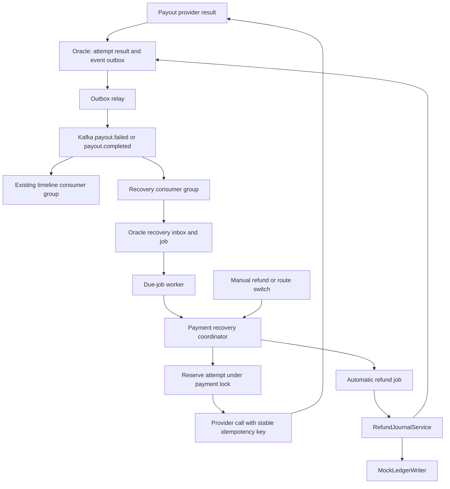

# Kafka-Driven Payout Retry and Automatic Refund

**Status:** Approved design; implementation has not started

**Date:** 2026-09-11

**Scope:** Mock-profile payout recovery using Kafka, Oracle scheduling, and the existing in-memory ledger

## Relationship to the earlier proposal

This document is the implementation authority for the first automatic-recovery release. It supersedes the retry-policy and refund-scope sections of `docs/kafka-payout-retries-design.md` where they conflict with this specification. In particular, this release permits five retries at fixed ten-minute intervals and automatically refunds a confirmed failed payment after the retry budget is exhausted.

The earlier document remains useful background for provider idempotency, reconciliation, inbox/outbox processing, and operational safety.

## Objective

When a payout receives a confirmed retryable failure, Fluxpay will make up to five additional payout attempts on a durable schedule. Each retry becomes eligible ten minutes after the preceding confirmed failure. If all five retries fail, Fluxpay will automatically compensate the sender through the existing refund flow.

The initial submission is attempt 1. Automatic retries are attempts 2 through 6 and have retry sequence numbers 1 through 5. A retry reuses funds already held for the payment and must never debit the sender wallet again.

## Goals

- Schedule exactly five additional attempts after an initial confirmed transient failure.
- Wait ten minutes between confirmed failures and the next retry.
- Preserve pending retry schedules across backend restarts by storing them in Oracle.
- Avoid duplicate provider calls under duplicate Kafka delivery, concurrent workers, or process crashes.
- Reconcile ambiguous provider outcomes before permitting another attempt or refund.
- Automatically refund after the fifth retry has a confirmed failure.
- Allow the payment owner to request a manual refund or route switch while a retry is pending.
- Keep recovery orchestration independent of the final ledger implementation.
- Retain the existing payment timeline consumer independently of recovery processing.

## Non-goals

- Production-grade wallet durability in this release. The initial implementation uses `MockLedgerWriter`, whose balances and idempotency records are process-local.
- Automatically changing payout routes. Automatic retries use the current route; only the payment owner can request a route switch.
- Retrying an outcome whose provider status remains ambiguous.
- Automatically replaying poison records from the dead-letter topic.
- Implementing a provider that lacks idempotent submission and status lookup guarantees.

## Architecture



Kafka announces payout outcomes. It does not provide the ten-minute timer. Oracle stores the recovery decision and due time, allowing jobs to survive a backend restart and allowing manual actions to cancel pending work atomically.

The existing `fluxpay-timeline` consumer continues to ingest all payment events into `payment_events`. A new `fluxpay-payout-recovery` consumer subscribes to `payout.failed` in a separate group so both timeline and recovery functions receive every failure.

## Retry policy

| Rule | Required behavior |
| --- | --- |
| Initial submission | Attempt 1; not counted as a retry |
| Maximum retries | 5 additional attempts |
| Maximum attempts | 6 total, including the initial submission |
| Retry delay | Fixed 10 minutes after each confirmed transient failure |
| Jitter | None |
| Route | Current route; automatic recovery never changes it |
| Confirmed transient failure | Schedule the next retry if budget remains |
| Confirmed failure after retry 5 | Schedule automatic refund immediately |
| Confirmed permanent failure | Skip pointless retries and schedule automatic refund immediately |
| Ambiguous outcome | Reconcile with the provider; do not retry or refund before confirmation |
| Confirmed success | Mark complete and cancel all pending retry/refund jobs |
| Retry debit | Forbidden; retries use the payment's already-held funds |

The ten-minute delay begins when the confirmed failure is durably recorded, not when a Kafka message happens to be consumed. If an ambiguous outcome is later confirmed as a transient failure, the delay begins at the time that confirmation is persisted.

## Components

### Payout result recorder and outbox relay

The initial submission and every recovery attempt persist the provider result and a canonical payment-event outbox row in one Oracle transaction. An outbox relay publishes the saved envelope and marks it published only after Kafka acknowledges it. Publication retry is infrastructure work and never consumes the business retry budget.

### `PayoutFailureConsumer`

The new consumer subscribes to `payout.failed` using group `fluxpay-payout-recovery`. In one Oracle transaction it:

1. Validates the envelope and Kafka metadata.
2. Deduplicates the event in `recovery_event_inbox`.
3. Locks the payment recovery row.
4. Verifies that the event describes the current failed attempt.
5. Applies `RecoveryPolicy`.
6. Creates one retry or refund job, or records a durable no-op/reconciliation decision.

The consumer returns successfully only after this transaction commits. Provider calls never run on a Kafka listener thread.

### `RecoveryPolicy`

This component classifies confirmed provider results and decides among `SCHEDULE_RETRY`, `SCHEDULE_REFUND`, `RECONCILE`, and `NO_ACTION`. The classification uses explicit provider-specific codes and outcome certainty, not free-form error messages.

### `RecoveryJobWorker`

A scheduled worker polls Oracle for due jobs every five seconds. It claims jobs using a lease, then delegates all payment-level decisions to `PaymentRecoveryCoordinator`. Multiple backend instances may run the worker; database constraints, leases, and payment locking prevent duplicate execution.

### `ProviderReconciliationService`

An ambiguous result enters `RECONCILING`. This service queries the provider using the persisted attempt idempotency key or provider reference. Confirmed success completes the payment. Confirmed failure re-enters the normal policy. An unresolved result remains blocked for reconciliation and cannot trigger payout or refund.

### `PaymentRecoveryCoordinator`

Automatic retries, automatic refunds, manual refunds, and manual route switches use one coordinator and lock the same `payment_recovery_state` row before changing recovery state. This provides a single ordering point for competing actions.

Manual retry is disabled while automatic recovery is enabled. A manual refund or route switch is allowed only when no provider call is active. It cancels a pending automatic job in the same transaction. A route switch consumes the existing five-retry budget and does not reset it; if the switched attempt fails and budget remains, normal scheduling may continue on the newly selected route.

### Automatic refund adapter

The first implementation calls the existing `RefundJournalService` through the `LedgerWriter` abstraction. `RefundJournalService` posts a clearing-wallet `DEBIT` and sender-wallet `CREDIT` using deterministic `refund:<paymentId>:*` keys. `MockLedgerWriter` supplies the initial implementation.

The recovery subsystem must not depend directly on `MockLedgerWriter`. The durable ledger being developed by the other team can replace it through `LedgerWriter` without changing Kafka consumption, retry scheduling, or policy code.

## Event contract

The existing `PaymentEventEnvelope` remains the outer contract: `eventType`, `eventId`, `paymentId`, `correlationId`, `occurredAt`, and `payload`.

Failure payloads retain `routeCode`, `attempt`, `summary`, `error`, and `errorMessage`, and add:

```json
{
  "schemaVersion": 2,
  "attemptId": "persisted-attempt-id",
  "retrySequence": 3,
  "outcomeCertainty": "CONFIRMED_FAILED",
  "failureCategory": "TRANSIENT",
  "providerIdempotencyKey": "payout:persisted-attempt-id"
}
```

The recovery consumer verifies that the Kafka key equals `paymentId`, the topic equals `eventType`, the attempt is positive, and the attempt ID identifies the current persisted attempt. Amounts, wallet IDs, beneficiary details, route configuration, retry count, and payment status come from authoritative application state rather than the event payload.

Legacy failure events without certainty and attempt identity are acknowledged only after a `LEGACY_EVENT_REVIEW_REQUIRED` decision is stored. They do not initiate automatic money movement.

## Oracle state

New migrations use the next available Flyway versions when implementation begins. Existing applied migrations are not edited.

### `payment_recovery_state`

One row per payment containing:

- Payment identifier and optimistic-lock version.
- Disposition: `IDLE`, `RETRY_PENDING`, `RETRY_IN_FLIGHT`, `RECONCILING`, `REFUND_PENDING`, `REFUND_IN_FLIGHT`, `COMPLETED`, or `REFUNDED`.
- Number of retries already reserved, from 0 through 5.
- Active attempt ID and active job ID.
- Current route ID.
- Last confirmed failure and timestamps.

This row is the shared lock for all automatic and manual recovery actions.

### `payout_recovery_jobs`

Durable jobs with:

- Job ID and action: `RETRY` or `AUTO_REFUND`.
- Payment ID, source event ID, and failed attempt ID.
- Retry sequence and target attempt number when applicable.
- Status: `PENDING`, `IN_FLIGHT`, `SUCCEEDED`, `FAILED`, `CANCELLED`, `EXHAUSTED`, or `RECONCILIATION_REQUIRED`.
- Due time, creation time, completion time, and decision reason.
- Lease owner, token, and expiry.
- Reserved attempt ID.

Unique constraints cover source event ID, failed attempt ID/action, `(payment_id, retry_sequence)`, and the existing `(payment_id, attempt_number)` attempt constraint. A conditional application-level invariant permits at most one active job per payment; implementation should enforce it with an Oracle-compatible constraint or locking protocol.

### `recovery_event_inbox`

Stores unique event ID, topic, partition, offset, payload hash, processing decision, and processed time. A duplicate event with the same hash reuses the durable decision. The same event ID with a different hash is quarantined.

### `payment_event_outbox`

Stores stable event ID, topic, payment key, serialized envelope, timestamps, publication attempts, next publication time, and relay lease data.

## Transaction and execution boundaries

1. **Record outcome:** Persist attempt outcome, recovery-state transition, and outbox event in one Oracle transaction.
2. **Publish event:** Relay the outbox envelope to Kafka and mark it published after broker acknowledgement.
3. **Schedule:** The recovery consumer commits inbox and job records before acknowledging the Kafka offset.
4. **Claim:** The worker claims a due job in a short transaction with a lease.
5. **Reserve:** Under the payment lock, recheck current state and reserve a new attempt with idempotency key `payout:<attemptId>`. Commit before provider I/O.
6. **Execute:** Call the provider outside an Oracle transaction with a bounded timeout.
7. **Finalize:** Under the payment lock, fence stale workers by lease token, persist the result, and create the corresponding outbox event.
8. **Exhaust:** When retry 5 fails, atomically transition to `REFUND_PENDING` and insert one immediate `AUTO_REFUND` job.
9. **Refund:** Under the payment lock, recheck that no payout succeeded and invoke `RefundJournalService`. Mark `REFUNDED` and write the refund outbox event.

For this mock release, step 9 cannot be atomic across Oracle and `MockLedgerWriter` because the ledger is in process memory. The implementation and tests must state this limitation rather than presenting it as crash-safe. When the durable ledger is available, its transaction or durable command contract becomes a release gate for production automatic refunds.

## Crash and concurrency behavior

| Situation | Required behavior |
| --- | --- |
| Duplicate `payout.failed` delivery | Inbox returns the stored decision; no second job |
| Crash after job commit but before Kafka offset commit | Redelivery finds the same inbox decision |
| Two workers claim a job | Only the valid lease token may reserve/finalize work |
| Crash before provider call | Lease recovery inspects the reserved attempt before proceeding |
| Provider accepted but response was lost | Reconcile the same attempt; never allocate another attempt immediately |
| Late result from an expired worker | Fenced write is rejected unless it matches the current attempt and state |
| Manual action wins before reservation | Pending automatic job is cancelled atomically |
| Automatic attempt already active | Manual refund/switch returns a conflict |
| Old failure after completion or refund | Record a stale-event no-op |
| Kafka or Oracle outage | Retry message/job processing without consuming a payout retry |
| Mock-ledger refund followed by process restart | Known demo limitation; balance/idempotency state resets and production safety is not claimed |

## Infrastructure and dead letters

Malformed or inconsistent recovery messages are sent to `payout.recovery.dlt` with source topic, partition, offset, readable event ID, error category, and a deterministic quarantine ID. The source offset advances only after the DLT send is acknowledged. The DLT is operational data and is not part of the payment timeline event whitelist.

Database outages and failed DLT publication leave the source record retryable. Exhausted business retries are not poison events and do not go to the DLT; they create an automatic refund job.

## Configuration

```yaml
fluxpay:
  payout-recovery:
    enabled: ${PAYOUT_RECOVERY_ENABLED:false}
    consumer-group: fluxpay-payout-recovery
    max-retries: 5
    retry-delay: 10m
    worker-poll-interval: 5s
    lease-duration: 60s
    reconciliation-poll-interval: 1m
    automatic-refund-enabled: true
```

Configuration is validated at startup: retry count must be 5 for this release, delay must be positive, lease duration must exceed the expected claim transaction, and automatic refund must be enabled whenever automatic execution is enabled.

The feature defaults off. Disabling it stops new retry scheduling and reservations but permits already-active provider results to be finalized. The outbox relay and reconciliation processing continue so state is not stranded.

## Observability

Structured logs include payment ID, attempt ID, retry sequence, event ID, job ID, correlation ID, route, policy decision, lease token identifier, and state transition. Logs exclude beneficiary data, wallet credentials, and secrets.

Metrics include:

- Recovery-consumer lag and inbox decisions.
- Pending, overdue, active, cancelled, and failed jobs.
- Retry outcomes by sequence and provider.
- Oldest pending outbox age and publication failures.
- Ambiguous outcomes and reconciliation age.
- Automatic refund success/failure.
- Duplicate/stale events and fenced worker writes.

Alerts cover sustained Kafka lag, overdue jobs, expired active leases, unresolved ambiguous outcomes, outbox backlog, refund failures, and DLT growth.

## Acceptance tests

The feature is accepted when these scenarios pass:

1. An initial confirmed transient failure followed by five confirmed failures creates exactly six payout attempts and exactly one sender refund credit.
2. Each retry becomes eligible no earlier than ten minutes after the preceding confirmed failure, verified with an injected clock.
3. Success on retry 1 through 5 cancels later jobs and creates no refund.
4. A confirmed permanent failure creates no retry and proceeds directly to automatic refund.
5. An ambiguous outcome creates no new attempt or refund until provider status confirms success or failure.
6. Duplicate and out-of-order Kafka events create no duplicate jobs, attempts, or refunds.
7. Restarting the backend while a retry is pending preserves its Oracle due time.
8. Manual refund or route switch cancels a pending job under the payment lock.
9. A manual action conflicts while a provider attempt is active.
10. Concurrent workers cannot execute or finalize the same attempt twice.
11. Kafka, database, and outbox failures do not consume the five business retries.
12. No initial retry, later retry, or route switch adds another sender debit.
13. Repeated automatic-refund handling uses the same deterministic mock-ledger keys and does not duplicate the credit within one process.
14. Tests explicitly demonstrate that restarting `MockLedgerWriter` loses balance and refund-idempotency state; the suite labels this as a known non-production limitation.

Unit tests cover policy classification, counting, delay calculation, state transitions, and configuration. Oracle integration tests cover constraints, locking, inbox/outbox commits, job leases, and cancellation. Kafka-plus-Oracle tests cover group independence, redelivery, and commit-before-ack. Provider contract tests cover stable idempotency keys and status reconciliation. End-to-end tests use a deterministic mock provider that can fail a configured number of attempts and then succeed.

## Delivery sequence

1. Add configuration, recovery-state enums, provider outcome certainty, and deterministic mock-provider controls.
2. Add Oracle inbox, job, recovery-state, and outbox migrations and repositories.
3. Refactor payout result persistence and Kafka publication behind the transactional outbox.
4. Add the recovery consumer and policy in decision-only mode.
5. Add the leased retry worker, provider idempotency, and reconciliation flow.
6. Add automatic refund jobs using `RefundJournalService` and `MockLedgerWriter`.
7. Coordinate manual refund and route switch through `PaymentRecoveryCoordinator`; disable manual retry while automatic recovery is enabled.
8. Add metrics, DLT handling, integration tests, and the runtime enablement flag.
9. Enable the feature only in the mock integration environment.

## Release boundaries

This design is safe for a controlled mock/demo environment once its tests pass. Production activation remains blocked until:

- The durable ledger replaces `MockLedgerWriter` and defines a crash-safe refund/idempotency contract.
- Each enabled provider supports stable idempotent submission and authoritative status lookup.
- Provider-specific transient/permanent error mappings are approved.
- Operations owns reconciliation alerts and DLT review.
- The outbox, recovery jobs, and refund path pass crash and concurrency testing against production-equivalent infrastructure.
